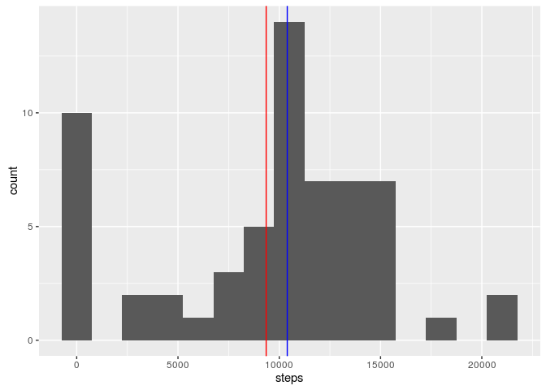
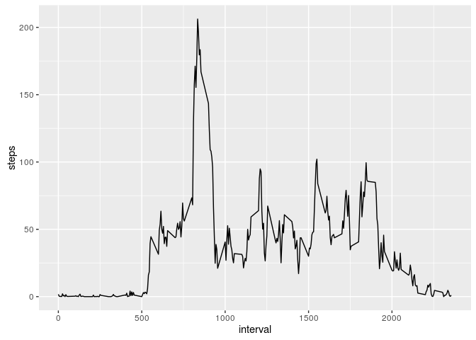
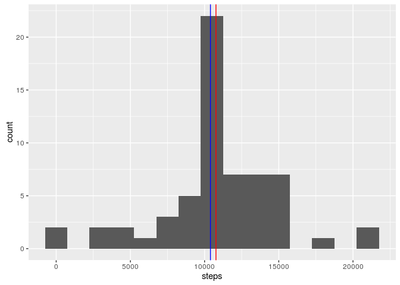
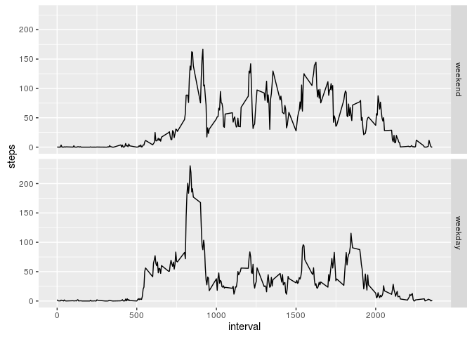

# Reproducible Research: Peer Assessment 1

Some notes on this Rmd file are available in the file NOTES.md

## Loading required libraries and packages

```r
suppressPackageStartupMessages({
  library(dplyr)
  library(ggplot2)
})
```


## Loading and preprocessing the data

```r
if (!file.exists("activity.csv")) {
  if (!file.exists("activity.zip")) {
    download.file("https://d396qusza40orc.cloudfront.net/repdata%2Fdata%2Factivity.zip", "activity.zip", method = "libcurl")
  }
  unzip("activity.zip")
}
activity <- read.csv("activity.csv", header = TRUE, stringsAsFactors = FALSE)
activity$date <- as.Date(activity$date)
head(activity)
```

```
##   steps       date interval
## 1    NA 2012-10-01        0
## 2    NA 2012-10-01        5
## 3    NA 2012-10-01       10
## 4    NA 2012-10-01       15
## 5    NA 2012-10-01       20
## 6    NA 2012-10-01       25
```


## What is mean total number of steps taken per day?

First I calculate the number of steps taken each day:


```r
steps_per_day <- activity %>% group_by(date) %>% summarise(steps = sum(steps, na.rm = T))
mean_steps_day <- mean(steps_per_day$steps)
median_steps_day <- median(steps_per_day$steps)
```

The figure below shows the histogram of the steps taken each day, the mean value (9354.2295082 steps, red) and the median value (10395 steps, blue)


```r
p <- ggplot(steps_per_day, aes(x=steps)) + geom_histogram(binwidth = 1500) +
  geom_vline(xintercept = mean_steps_day, color="red") +
  geom_vline(xintercept = median_steps_day, color="blue") 
p
```

<!-- -->

## What is the average daily activity pattern?


```r
interval_activity <- activity %>% group_by(interval) %>% summarise(steps = mean(steps, na.rm=T))
interval_max_steps <- interval_activity$interval[which.max(interval_activity$steps)]
```

The interval with the average number of steps across all days is 835.


```r
p <- ggplot(interval_activity, aes(x=interval, y = steps)) + geom_line()
p
```

<!-- -->

## Imputing missing values


```r
n_rows_with_NA <- sum(ifelse(is.na(activity$steps),1,0))
```
The original dataset contains 2304 rows with missing values.

I imputed the value by using the average value in the same interval (which I already had to compute for the previous step):


```r
activity_imputed <- activity %>% left_join(select(interval_activity, interval, avg = steps), by = "interval") %>%
  mutate(steps_imputed = ifelse(is.na(steps), avg, steps))
head(activity_imputed)
```

```
##   steps       date interval       avg steps_imputed
## 1    NA 2012-10-01        0 1.7169811     1.7169811
## 2    NA 2012-10-01        5 0.3396226     0.3396226
## 3    NA 2012-10-01       10 0.1320755     0.1320755
## 4    NA 2012-10-01       15 0.1509434     0.1509434
## 5    NA 2012-10-01       20 0.0754717     0.0754717
## 6    NA 2012-10-01       25 2.0943396     2.0943396
```


```r
steps_per_day_imputed <- activity_imputed %>% group_by(date) %>% summarise(steps = sum(steps_imputed))
mean_steps_day_imputed <- mean(steps_per_day_imputed$steps)
median_steps_day_imputed <- median(steps_per_day_imputed$steps)
```

The figure below show the histogram of steps per day when imputing the number of steps using the average value in the interval,
the mean value (1.076619\times 10^{4} steps, red line) and the median_value (1.076619\times 10^{4} steps, blue line):


```r
p <- ggplot(steps_per_day_imputed, aes(x=steps)) + geom_histogram(binwidth = 1500) +
  geom_vline(xintercept = mean_steps_day_imputed, color="red") +
  geom_vline(xintercept = median_steps_day, color="blue") 
p
```

<!-- -->

## Are there differences in activity patterns between weekdays and weekends?


```r
ts_activity_imputed <- activity_imputed %>% mutate(day_type = factor(weekdays(date) %in% c("Saturday","Sunday"), 
                                              levels = c(TRUE, FALSE), labels = c("weekend","weekday"))) %>%
  group_by(day_type, interval) %>% summarise(steps = mean(steps_imputed)) %>% ungroup() %>%
  arrange(day_type, interval)

head(ts_activity_imputed)
```

```
## # A tibble: 6 × 3
##   day_type interval       steps
##     <fctr>    <int>       <dbl>
## 1  weekend        0 0.214622642
## 2  weekend        5 0.042452830
## 3  weekend       10 0.016509434
## 4  weekend       15 0.018867925
## 5  weekend       20 0.009433962
## 6  weekend       25 3.511792453
```


```r
p <- ggplot(ts_activity_imputed, aes(x = interval, y = steps)) + geom_line() + 
  facet_grid(day_type ~ .)
p
```

<!-- -->
