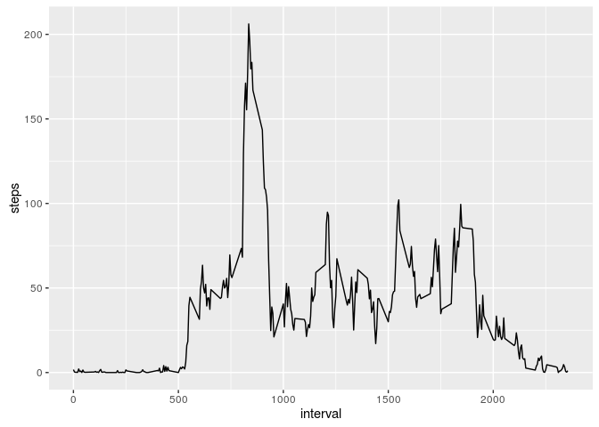

# Reproducible Research: Peer Assessment 1

## Loading required libraries and packages

```r
suppressPackageStartupMessages({
  library(dplyr)
  library(ggplot2)
})
```


## Loading and preprocessing the data

```r
if (!file.exists("activity.csv")) {
  if (!file.exists("activity.zip")) {
    download.file("https://d396qusza40orc.cloudfront.net/repdata%2Fdata%2Factivity.zip", "activity.zip", method = "libcurl")
  }
  unzip("activity.zip")
}
activity <- read.csv("activity.csv", header = TRUE)
head(activity)
```

```
##   steps       date interval
## 1    NA 2012-10-01        0
## 2    NA 2012-10-01        5
## 3    NA 2012-10-01       10
## 4    NA 2012-10-01       15
## 5    NA 2012-10-01       20
## 6    NA 2012-10-01       25
```


## What is mean total number of steps taken per day?

First I calculate the number of steps taken each day:


```r
steps_per_day <- activity %>% group_by(date) %>% summarise(steps = sum(steps, na.rm = T))
mean_steps_day <- mean(steps_per_day$steps)
median_steps_day <- median(steps_per_day$steps)
```

The figure below shows the histogram of the steps taken each day, the mean value (9354.2295082 steps, red) and the median value (10395 steps, blue)


```r
p <- ggplot(steps_per_day, aes(x=steps)) + geom_histogram(binwidth = 1500) +
  geom_vline(xintercept = mean_steps_day, color="red") +
  geom_vline(xintercept = median_steps_day, color="blue") 
p
```

<!-- -->

## What is the average daily activity pattern?


```r
ts_activity <- activity %>% group_by(interval) %>% summarise(steps = mean(steps, na.rm=T))
p <- ggplot(ts_activity, aes(x=interval, y = steps)) + geom_line()
p
```

<!-- -->


```r
interval_max_steps <- ts_activity$interval[which.max(ts_activity$steps)]
```

The interval with the average number of steps across all days is 835.

## Imputing missing values


## Are there differences in activity patterns between weekdays and weekends?
